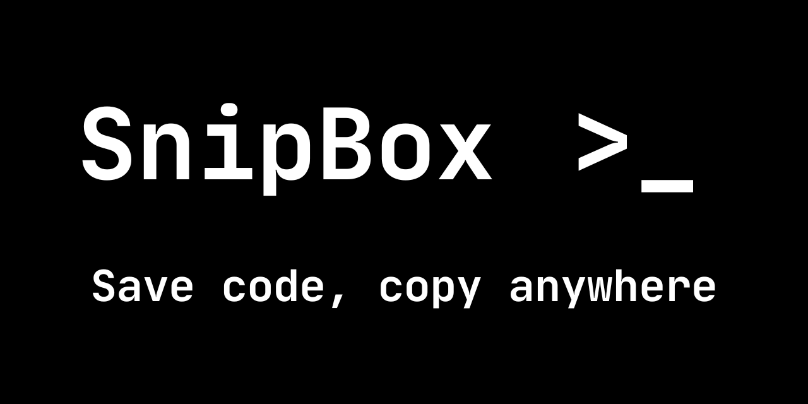
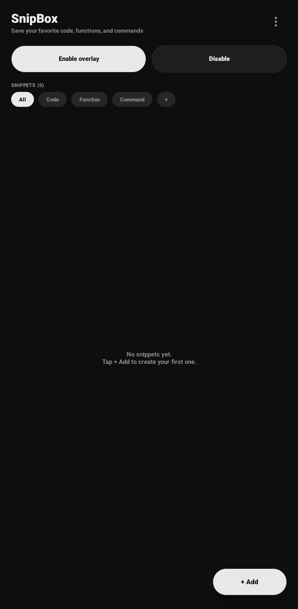
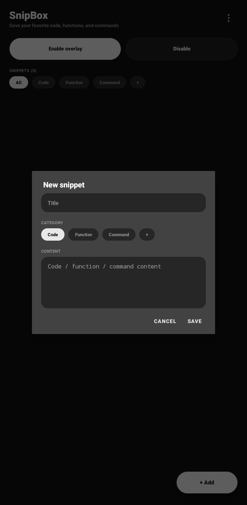

<p align="center">
  
</p>

# SnipBox

🌐 **English** | [Bahasa Indonesia](README.id.md)

An Android app for saving your favorite **code, functions, and commands** and copying them with a single tap, from anywhere, through a floating icon that appears on top of other apps.

All data is stored locally on the device. The app does not request internet permission.


## Features

- **Save snippets:** title, content, and category. Tap a snippet to copy it to the clipboard.
- **Custom categories:** Code, Function, and Command are built in. Add, rename, or delete categories as you like (long-press a category). A category that still contains snippets cannot be deleted.
- **Floating bubble:** appears on top of other apps. Tap it to open the snippet panel, and drag it anywhere on the screen.
- **Flexible overlay panel:**
  - move it by dragging the small bar at the top of the panel,
  - resize it by dragging the bottom-right corner,
  - search snippets and filter by category.
- **Adjustable sizes:** three-dot menu, then "Overlay & icon size" (panel width, panel height, icon size). The Reset button restores default sizes and positions.
- **Quick Settings tile:** turn the floating bubble on or off from the quick panel without opening the app.
- **Landscape support**, and the bubble never slips under the navigation bar.
- **Monochrome look** (black, gray, white).

## Screenshots

| Preview 1 | Preview 2 |
|-------------|---------------|
|  |  |

## Usage

1. Open SnipBox, tap **+ Add**, enter a title, pick a category, write the snippet, then **Save**.
2. Tap **Enable overlay**. The first time, you will be asked to allow **Display over other apps**.
3. The floating bubble appears. Tap it to open the panel, tap a snippet to copy it, then paste it into any app.
4. Tap **Disable** (or the Disable button in the notification) to stop the overlay.

### Adding the Quick Settings tile

Pull down the notification shade, tap the pencil or add icon, then drag the **SnipBox** tile into the quick panel.

### Tips for Samsung (One UI) and other devices

Some devices kill background apps to save battery. If the bubble disappears on its own, open the three-dot menu, choose **Allow running in background**, and allow SnipBox.

## Permissions

| Permission | Purpose |
| --- | --- |
| `SYSTEM_ALERT_WINDOW` | Show the bubble and panel on top of other apps |
| `FOREGROUND_SERVICE`, `FOREGROUND_SERVICE_SPECIAL_USE` | Keep the overlay alive |
| `POST_NOTIFICATIONS` | Overlay-active notification (Android 13+) |
| `REQUEST_IGNORE_BATTERY_OPTIMIZATIONS` | Optional, so the system does not kill the overlay |

## Download

Get the latest APK from the [Releases](../../releases) page, or from the **Artifacts** section of any successful run in the [Actions](../../actions) tab. Installing it requires allowing **Install unknown apps** on your device.

## Build

The project uses Gradle and Kotlin with no extra UI libraries beyond AppCompat and Material. It needs JDK 17 and Gradle 8.7 or newer (or open the folder in Android Studio).

```bash
gradle assembleDebug
```

The resulting APK is in `app/build/outputs/apk/debug/`.

### Build with GitHub Actions

The workflow in `.github/workflows/build.yml` builds the debug APK on every push and uploads it as the **SnipBox-debug-apk** artifact. You can also start it manually from the Actions tab with **Run workflow**.

## Code structure

```
app/src/main/java/com/arionacc/snipbox/
├── MainActivity.kt        Main screen, snippet editor, categories, settings menu
├── OverlayService.kt      Floating bubble and overlay panel (drag, resize)
├── OverlayTileService.kt  Quick Settings tile
├── Ui.kt                  Colors, UI components, snippet card adapter, category chips
├── Prefs.kt               Size/position settings and category storage
├── Snippet.kt             Snippet data class and local storage (SnippetStore)
└── SnipApp.kt             Application class and last-crash logger
```

If the app stops unexpectedly, a dialog with the error details (which you can copy) appears the next time you open it. This is useful for reporting bugs.

## Contributing

Issues and pull requests are welcome. For larger changes, please open an issue first so it can be discussed.

## License

Released under the [MIT License](LICENSE).
